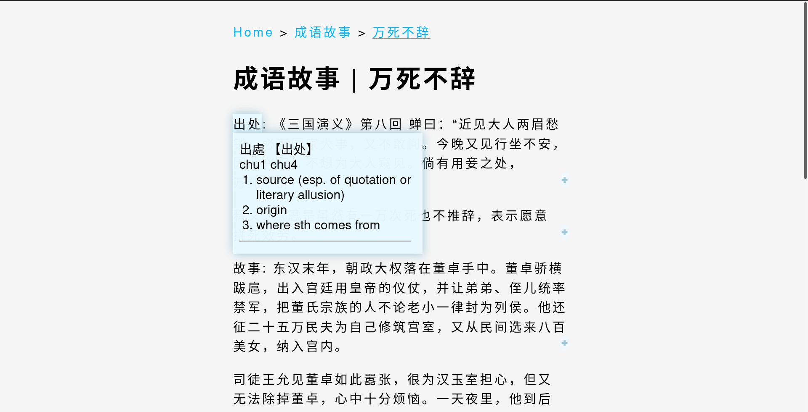

# CE-Reader

Enjoy reading your favorite Chinese books without constantly looking up dictionary.



The Chinese-English dictionary [CC-CEDICT](https://cc-cedict.org/wiki/start) is used to tokenze text, and create popover translation.

Sample book: [活着](https://www.zanghaihua.org/huozhou/)

## Quick Start

To get this project up and running locally on your computer:

1. Set up a [Nodejs](https://wiki.developer.mozilla.org/en-US/docs/Learn/Server-side/Express_Nodejs/development_environment) development environment.
1. Enter the following commands in the root of your clone of this repo:
   ```
   npm install
   DEBUG=reader:* npm run devstart   #For linux
   ```
1. Open a browser to http://localhost:3000/ and start reading.

## Add New Book

To add a new book:

1. Create a folder `new_book_name` under `public` folder
   ```
   mkdir public/new_book_name
   ```
1. Put every chapter of this book inside this `new_book_name` folder.

> **Note**: Every chapter must be a plain text file, use `utf-8` encoding.
